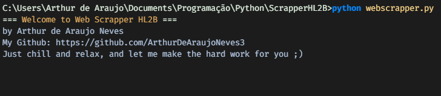
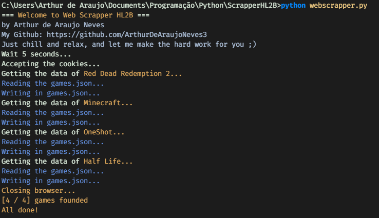
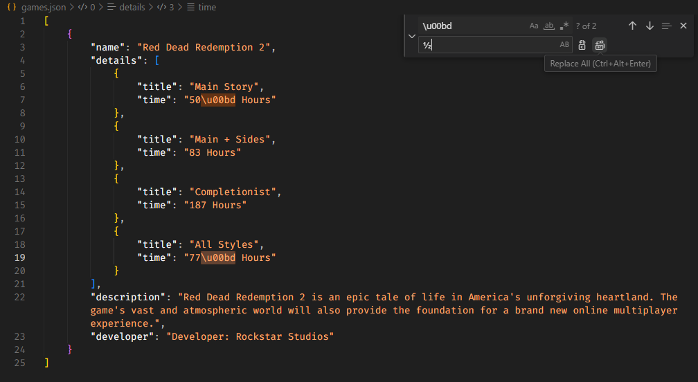

# Web Scraper for How Long To Beat with Python

Hello, for those whi don't know the page [How Long To Beat](https://howlongtobeat.com/), this page has a lot of information about games, but they dont have a public API. So, i made this script with Python for get the data of the games.

## Prerequisites

- Python 3.x
- Firefox ( you can change in the code )

> [!NOTE]
> For a better experience with the script, i recommend you to use a terminal [Tabby](https://tabby.sh/)

**Python Libraries**

- BeautifulSoup4
- pandas
- selenium 

## Installing

First, clone the repository
```ruby
git clone https://github.com/ArthurDeAraujoNeves3/HL2B-Scraper.git
```

To install all the python libraries, just put this command in terminal
```ruby
pip install -r requirements.txt
```

## How use this script

First of all, put all the names of the games if you want in the **gameName** Array like this
```
gameName = ['Red Dead Redemption 2', 'Minecraft', 'OneShot', 'Half Life']
```

After this, just run the script
```ruby
python webscraper.py
```

**Script starting**


**Script complete**


> [!CAUTION]
> While the script is running, **do not change any .json file**

## Structure of the JSON

The script will write in file games.json, like this
```
[
    {
        "name": "Red Dead Redemption 2",
        "details": [
            {
                "title": "Main Story",
                "time": "50\u00bd Hours"
            },
            {
                "title": "Main + Sides",
                "time": "83 Hours"
            },
            {
                "title": "Completionist",
                "time": "187 Hours"
            },
            {
                "title": "All Styles",
                "time": "77\u00bd Hours"
            }
        ],
        "description": "Red Dead Redemption 2 is an epic tale of life in America's unforgiving heartland. The game's vast and atmospheric world will also provide the foundation for a brand new online multiplayer experience.",
        "developer": "Developer: Rockstar Studios"
    }
]
```

> [!NOTE]
> In games.json, there is a text like this '\u00bd', this text is '½', but in the code, i tried change it with ```replace('\u00bd', '½')``` but when i write it in JSON, itt doesn't work. So, if you use **Visual Studio Code**, just change it with `ctrl + f` and **Replace all**


## Run in background

<<<<<<< HEAD
If you preferer, placing the var `option` inside of `webdriver.Firefox()`, the browser will run in background without the need to open it

```ruby
browser = webdriver.Firefox(option) #Opening the browser in background
```

By default, i have disabled this option
=======
> [!CAUTION]
> While the script is running, **DO NOT CHANGGE ANY .json FILE**
>>>>>>> 4531a0d57bd58698c51a61103db4877259051050

## License

[MIT License](License)
